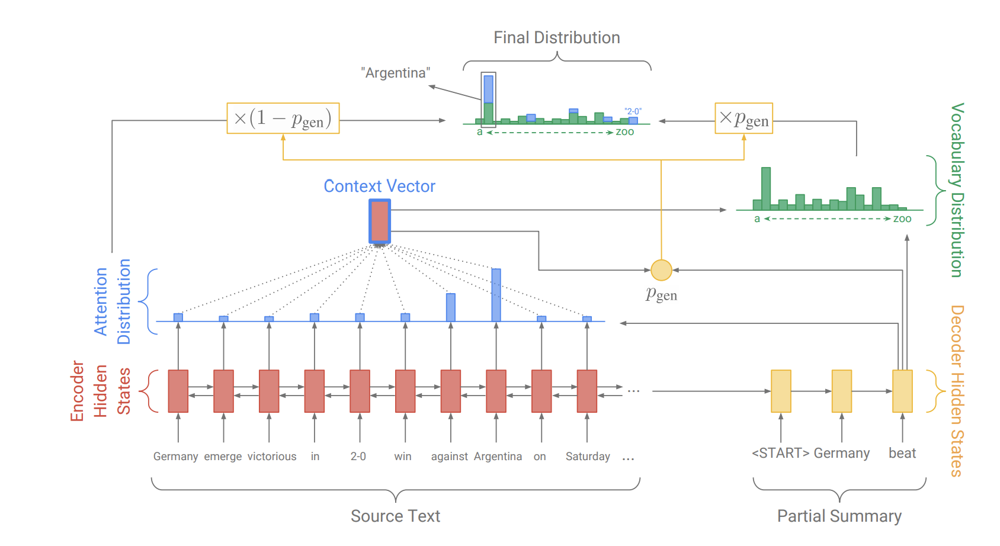
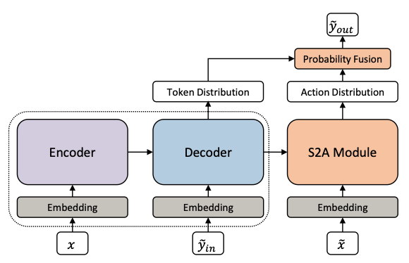

# 语法纠错模型
## Pointer Generator Network（指针生成网络）
### 模型方案
1. 在尝试使用原生Transformer实现语法纠错模型时，发现结果很差，FPR特别高，这说明生成模型在生成纠正结果时，改动过大，把我们不希望修改的地方也给改了，基于这个问题，我们开始寻找一些思路，怎样能减少不必要的改动？于是想到了指针网络，这种网络可以从输入序列中选择token放到输出序列中，刚好符合我们的需求。那么，怎样满足既保留对的文本，又对错的文本进行生成呢？我们联想到了**文本摘要**任务，于是找到了一种比较合适和经典的方案**[指针生成网络](https://arxiv.org/pdf/1704.04368.pdf)**
2. 该网络的结构如下图所示，代码的实现部分参考了一篇[博客](https://www.cnblogs.com/zingp/p/11571593.html)，我们这里将原本的Bi-LSTM组成的Encoder和Decoder换成了Bart-large
3. 这个模型在实验结果方面超出了预期，大概是因为模型本身的降低过纠正的性能
4. 在基于文本生成的纠错中，必然会遇到[UNK]的问题，这里我们采取的方案是：对于每个纠正结果中的[UNK]，基于该token在输入序列中的注意力，注意力最高的那个token替换掉[UNK]
5. 训练策略为单步训练，训练数据为lang8+历年数据，一共1,155,138个样本
6. 训练的超参数配置为：

| 数据集  | lr     |max_seq_len|batch_size|dropout|scheduler|warmup|epoch|beam_k|GPU卡数|梯度累积|seed|
|:-------:|:-------:|:-----:|:-------:|:--------:|:------:|:-----:|:--------:|:-----:|:-----:|:--------:|:--------:|
| lang8+CGED历年训练集   |  5e-5  |256        |256       |0.1    |   cosine|0.0|10 |3 |2|16|99|
### 如何运行
#### Train
1. 修改`Pointer-Generator-Net/config/grammar_ptr_train.yml`配置文件中的超参数
2. `Pointer-Generator-Net/src/run_task_ptr.py`入口文件中第8和9行选择该配置文件的那一行
3. `python3 Pointer-Generator-Net/src/run_task_ptr.py`
4. 运行任务后，在工作目录下的`output/"task_name"/Log/`会生成同步的训练日志文件，包含训练过程中的每个验证结果的指标、保存的badcase文件地址、保存的最佳模型(模型文件名包含dev.0)和每个验证checkpoint模型(模型文件名包含checkpoint)地址
#### Test
1. 修改`Pointer-Generator-Net/config/grammar_ptr_predict.yml`配置文件中的超参数
2. `Pointer-Generator-Net/src/run_task_ptr.py`入口文件中第8和9行选择该配置文件的那一行
3. `python3 Pointer-Generator-Net/src/run_task_ptr.py`
4. 运行任务后，在工作目录下的`output/"task_name"/Log/`会生成同步的预测日志文件，包含测试集的预测结果(excel格式)文件地址
5. 将测试集预测结果通过`Grammar_Error_Correct/convert_predict.ipynb`转换为提交格式
### 实验记录
由于验证集的S和M纠正结果只有一个备选项，与线上评测情况可能存在出入（线上评测每个样本可能存在多个纠正结果），因此这里的验证集指标不考虑correction_f1与评测总分
|数据集|  FPR |   detect_f1 |   identification_f1 |   position_f1 |correction_f1|评测分数|
|:---:|:---:|:---:|:---:|:---:|:---:|:---:|
|20+21测试集|0.077|0.6837|0.443|0.2605|——|——|
|22测试集|0.0796|0.6995|0.4602|0.2997|0.2070|0.3967|
## Pointer Generator Network（指针生成网络）二阶段训练
### 模型方案
1. 基于语病检测任务中把lang8和历年数据集分阶段训练能提升效果，这里基于上述指针生成网络的最佳模型，尝试继续用历年数据进行二阶段微调，评测结果出乎意料的高，可能是因为二阶段微调让模型更清晰地学到了历年数据集的错误分布，而历年数据集相比于lang8来说，与22年测试集的错误分布更接近
2. 评测结果的变化为：FPR增大，检测相关的指标同样也增大，带来了整体指标的上升
### 如何运行
#### Train
1. 修改`Pointer-Generator-Net/config/grammar_ptr_train.yml`配置文件中的超参数
2. `Pointer-Generator-Net/src/run_task_ptr.py`入口文件中第8和9行选择该配置文件的那一行，注释第21行，高亮第23行，给`resume_model_path`赋值为上述指针生成网络的最佳模型地址，让任务基于最佳模型继续训练
3. `python3 Pointer-Generator-Net/src/run_task_ptr.py`
4. 运行任务后，在工作目录下的`output/"task_name"/Log/`会生成同步的训练日志文件，包含训练过程中的每个验证结果的指标、保存的badcase文件地址、保存的最佳模型(模型文件名包含dev.0)和每个验证checkpoint模型(模型文件名包含checkpoint)地址
5. 训练的超参数配置为：

| 数据集  | lr     |max_seq_len|batch_size|dropout|scheduler|warmup|epoch|beam_k|GPU卡数|梯度累积|seed|
|:-------:|:-------:|:-----:|:-------:|:--------:|:------:|:-----:|:--------:|:-----:|:-----:|:--------:|:--------:|
| CGED历年训练集   |  5e-6  |256        |256       |0.1    |   cosine|0.0|10 |3 |4|8|99|
#### Test
1. 修改`Pointer-Generator-Net/config/grammar_ptr_predict.yml`配置文件中的超参数
2. `Pointer-Generator-Net/src/run_task_ptr.py`入口文件中第8和9行选择该配置文件的那一行
3. `python3 Pointer-Generator-Net/src/run_task_ptr.py`
4. 运行任务后，在工作目录下的`output/"task_name"/Log/`会生成同步的预测日志文件，包含测试集的预测结果(excel格式)文件地址
5. 将测试集预测结果通过`Grammar_Error_Correct/convert_predict.ipynb`转换为提交格式
### 实验记录
由于验证集的S和M纠正结果只有一个备选项，与线上评测情况可能存在出入（线上评测每个样本可能存在多个纠正结果），因此这里的验证集指标不考虑correction_f1与评测总分
|数据集|  FPR |   detect_f1 |   identification_f1 |   position_f1 |correction_f1|评测分数|
|:---:|:---:|:---:|:---:|:---:|:---:|:---:|
|20+21测试集|0.1976|0.8136|0.5673|0.3517|——|——|
|22测试集|0.1431|0.80|0.5456|0.3553|0.2505|0.4521|
## Gector
### 模型方案
本模型基于论文《GECToR – Grammatical Error Correction: Tag, Not Rewrite》，是此模型在中文数据集上的应用，编码部分使用的预训练模型chinese-struct-bert-large。GECToR采用seq2edit思想解决语病修改问题，对一个源句子序列使用Transformer做encode，然后在每个token处使用MLP预测最可能的编辑label。对于序列中的每个token都映射到一个edit操作，edit操作包括KEEP, DELETE, APPEND, REPLACE，分别代表保存当前token、删除当前token、当前token后面添加相应的token、当前token替换成相应的token，其中KEEP和DELETE是单标签，APPEND和REPLACE需要拼接添加或者替换的token，比如“REPLACE_自”和“APPEND_下”。
## 训练超参数配置
第一步训练的冷启动部分我们设置参数如下：学习率是1e-3,batch_size是128，训练轮数是2，全部模型参数参与训练部分我们设置训练参数如下：学习率是1e-5,batch_size是48，训练轮数是20，patience是3。第二步训练设置训练参数如下：学习率是1e-5,batch_size是48，训练轮数是20，patience是3，全局随机种子设置都是1。
### 数据介绍
1、其中的lang8数据是来自官方提供的数据集，经过去空格、去英文、去繁体等操作后得到的数据，内容存在lang8_src.txt和lang8_trg.txt；
2、其中的历年数据是14-18年的所有训练集，去空格后存在data_train_14_to_18_src_without_kongge和data_train_14_to_18_trg_without_kongge中。
3、验证集来自往年数据的14-20年测试集，存在data_test_14_to_20_src.txt和data_test_14_to_20_trg.txt
### 训练环境
32G Tesla V100, CUDA Version: 11.4
运行需要的软件，在requiments.txt

### 训练步骤
1、运行pipline.sh,生成Best_Model_Stage_1.th和Best_Model_Stage_2.th
2、运行pipeline_2.sh,生成Best_Model_Stage_3.th

### 预测测试集
运行inference.sh

### 转化为官方提交格式
官方赛道2提供了baseline，其中CCL2022-CLTC-main/baselines/track2/metric/run_eval.sh提供的数据转化方法，确定预测结果路径如下：
SRC_PATH= track2/dataset/2022test/cged2022-test.txt （测试集）
HYP_PATH= results/cged2022_test.output（预测的结果）
OUTPUT_PATH = cged2022_test_result.txt
确定输入以后运行 python pair2edits_char.py $SRC_PATH $HYP_PATH > $OUTPUT_PATH

## Sequence-to-Action（腾讯AAAI 2022）
### 模型方案
1. 如上所述，个人理解语病纠错思路最大的问题即是如何解决过度纠正的问题，即尽可能保留对的字段，将错的字段改对。在搜寻该领域最新的论文时，找到了腾讯的这篇[SOTA文章](https://www.aaai.org/AAAI22Papers/AAAI-7494.LiJ.pdf)，论文未提供源码，我们尽量把论文的思路给复现出来了，尽管融合结果的最高分未采用该模型结果，但个人觉得这个方案值得拿出来探讨
2. 由于最终的提交结果未采用该模型，因此代码库单独开源在[github](https://github.com/AI-confused/Sequence-to-Action)上，感兴趣的伙伴可以去看
### 实验记录
由于验证集的S和M纠正结果只有一个备选项，与线上评测情况可能存在出入（线上评测每个样本可能存在多个纠正结果），因此这里的验证集指标不考虑correction_f1与评测总分
|数据集|  FPR |   detect_f1 |   identification_f1 |   position_f1 |correction_f1|评测分数|
|:---:|:---:|:---:|:---:|:---:|:---:|:---:|
|20+21测试集|0.2625|0.8279|0.4909|0.25|——|——|
|22测试集|0.2552|0.8273|0.5056|0.2745|0.1673|0.3799|