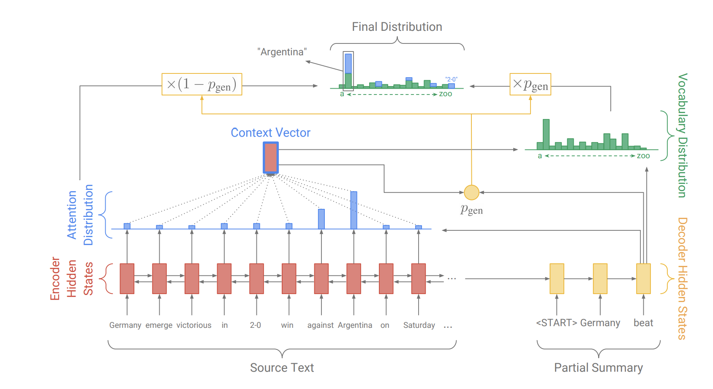

# 语法纠错模型
## Pointer Generator Network（指针生成网络）
### 模型方案
1. 在尝试使用原生Transformer实现语法纠错模型时，发现结果很差，FPR特别高，这说明生成模型在生成纠正结果时，改动过大，把我们不希望修改的地方也给改了，基于这个问题，我们开始寻找一些思路，怎样能减少不必要的改动？于是想到了指针网络，这种网络可以从输入序列中选择token放到输出序列中，刚好符合我们的需求。那么，怎样满足既保留对的文本，又对错的文本进行生成呢？我们联想到了**文本摘要**任务，于是找到了一种比较合适和经典的方案**[指针生成网络](https://arxiv.org/pdf/1704.04368.pdf)**
2. 该网络的结构如下图所示，代码的实现部分参考了一篇[博客](https://www.cnblogs.com/zingp/p/11571593.html)，我们这里将原本的Bi-LSTM改成了Bart-large
3. 这个模型在试验结果方面比较惊艳，也是我们参与融合的模型结果中最高的，大概取决于模型本身的降低过纠正的性能
4. 在基于文本生成的纠错中，必然会遇到[UNK]的问题，这里我们采取的方案是：对于每个纠正结果中的[UNK]，基于该token在输入序列中的注意力，注意力最高的那个token替换掉[UNK]
### 如何运行

### 实验记录

## Sequence-to-Action（腾讯AAAI 2022）
### 模型方案
1. 如上所述，个人理解语病纠错思路最大的问题即是如何解决过度纠正的问题，即尽可能保留对的字段，将错的字段改对。在搜寻该领域最新的论文时，找到了腾讯的这篇[SOTA文章](https://www.aaai.org/AAAI22Papers/AAAI-7494.LiJ.pdf)，论文未提供源码，我们尽量把论文的思路给复现出来了，尽管融合结果的最高分未采用该模型结果，但个人觉得这个方案值得拿出来探讨
2. 
### 如何运行

### 实验记录