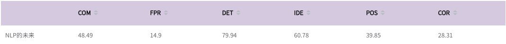

# CCL2022_CGED-8_Top1_project
## Description 
这是CCL-2022汉语学习者文本纠错评测任务赛道二：**CGED-8 Top 1**解决方案，该仓库包含可复现源码及方案思路，欢迎**Start**👏 😄

参赛队伍名：NLP的未来

组员：好未来TAL@李云良(liyunliang@tal.com)，好未来TAL@王智浩(wangzhihao3@tal.com)，好未来TAL@胡飞(hufei6@tal.com)

## 仓库结构
1. data_preprocess

    数据预处理模块，包含对lang8和历年数据的预处理代码及策略
2. dataset

    存放了直接用来训练的历年数据的训练集和验证集
3. Grammar_Error_Detect

    语法检测模型的代码、方案及说明
4. Grammar_Error_Correct

    语法纠错模型的代码、方案及说明

5. Spell_Correct

    拼写纠错模型的代码、方案及思路

6. model_fuse.ipynb

    模型融合策略代码

## 运行环境
### conda虚拟环境
    python 3.7.13
### 服务器环境
    CUDA Version: 11.4
    GPU: 8 * Tesla V100 32510 MiB
